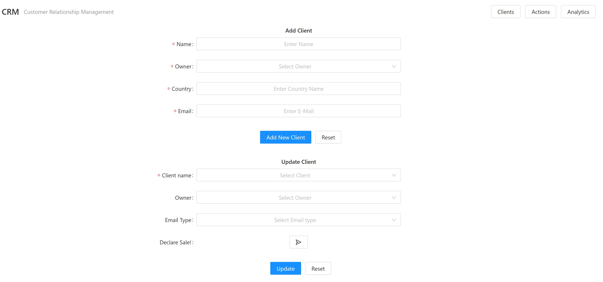
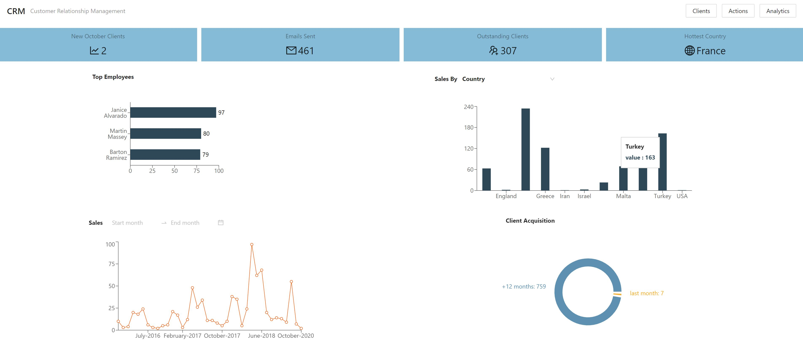

# CRM 
A Customer Relationship Management tool that allows companies to manage everything to-do with their customers.
3 screans to show all the clients with filtering, actions section to add and update and analytics about the clients and sealers.

### Installation

```
$ npm install
$ npm start
```

Runs the app in the development mode.<br />
Open [http://localhost:3000](http://localhost:3000) to view it in the browser.

### Screenshots



 

### Tech/framework used

* ReactJS
* NodeJS
* MySql
* express
* ant Design
* Rechart
* moment & dateFormat

### To Do
1. Adding manager page to edit sealers.
2. Sign-in/ register for sealers.
3. Designing.

